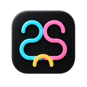

<h1 align="center">ToolBraid Companion</h1>

Your AI's connection to the browser, Windows and the work between them.

  
  
  

  <a href="https://toolbraid.pages.dev/">Website</a> ·
  <a href="INSTALL.md">Install</a> ·
  <a href="docs/capabilities.md">Full specs</a> ·
  <a href="docs/architecture.md">Architecture</a> ·
  <a href="RELEASE-NOTES.md">What's new</a>

  
  

ToolBraid combines a **WebMCP-enabled browser extension** and a **local Windows companion**. Connect it to your existing Codex session or another MCP client, or use the optional ChatGPT side-panel chat. Your assistant can work with real pages, desktop controls, approved files and repeatable workflows.

This is the official **downloads and documentation repository**. Application development source is not hosted here; GitHub's automatic **Source code** archives are not installers.

## Get started

**[Download for Windows](https://github.com/Maharajahu/ToolBraid-Companion/releases/download/v0.3.1-rc.1/ToolBraid-0.3.1-windows-x64.zip)** · [Extension only](https://github.com/Maharajahu/ToolBraid-Companion/releases/download/v0.3.1-rc.1/ToolBraid-0.3.1-extension.zip) · [Checksums](SHA256SUMS.txt)

1. Extract the Windows package and run `Install.cmd` as your normal Windows user.
2. In Chrome or Edge, enable **Developer mode → Load unpacked** and select its `extension` folder.
3. Enable your chosen site in ToolBraid and [connect your AI](INSTALL.md#4-connect-your-ai).

**Windows x64 · 0.3.1 RC1 · Free download.** The companion includes Node.js. This is a manual-install pre-release; the ZIP launcher is unsigned. See [compatibility and signing status](docs/compatibility.md) before installing.

## What it can do

| Area | Capabilities |
| --- | --- |
| Browser & WebMCP | Read pages, navigate tabs, fill forms, scroll, upload granted files and use native tools on compatible sites. |
| Windows & files | Inspect desktop accessibility controls; read, create, move and archive within approved local folders. |
| Visual & media | Screenshots, accessibility handles, configured visual analysis and local FFmpeg editing jobs. |
| Research & memory | Multi-tab evidence, source-linked snapshots, citation bundles and bounded local records. |
| Workflows | Checkpointed missions, reusable demonstrations, shadow replay and scheduled tool calls. |
| Community tools | X mentions, replies, requested posts, media and article drafts, plus other site-aware adapters. |

[Full capabilities and requirements →](docs/capabilities.md) · [How the components connect →](docs/architecture.md)

## Use the AI you already work with

- **Existing Codex session or another MCP client:** keep chatting and choosing models in that client.
- **Optional panel chat:** sign in to Codex with your ChatGPT account. Your Codex allowance applies; no API key for this route.
- **Local models:** use a tool-capable model in an external MCP host. The panel is not a universal provider or local-model selector.

Ask an assistant with tools on your Windows PC to help set it up:

> Install and configure ToolBraid Companion using https://toolbraid.pages.dev/agent-setup.txt. Check my existing installation, verify the official download's SHA-256, preserve other MCP settings, and finish with a read-only connection test.

[Copy the complete setup prompt](https://toolbraid.pages.dev/#ai-setup) · [Manual setup](INSTALL.md). Browser permissions and account sign-in may still need you.

## Real Windows demo

https://github.com/user-attachments/assets/5696a89b-59d6-4fd8-ad80-023f04fb16b7

Real pages and model responses, an X reply draft, and browser navigation. **1:23 · No audio.** Edited for pace; no live X post in the recording.

[Website player and video description](https://toolbraid.pages.dev/#demo) · [4K export](https://github.com/Maharajahu/ToolBraid-Companion/releases/download/v0.3.1-rc.1/ToolBraid-Windows-real-demo-4K.mp4)

## The interface

<table>
  <tr><th width="50%">Optional agent chat</th><th width="50%">Community & site tools</th></tr>
  <tr>
    <td width="50%" valign="top"></td>
    <td width="50%" valign="top"></td>
  </tr>
</table>

## Documentation

- [Installation, AI connections and troubleshooting](INSTALL.md)
- [Compatibility, permissions and recorded validation](docs/compatibility.md)
- [Release history](RELEASE-NOTES.md) · [Data handling](https://toolbraid.pages.dev/privacy/)

## Feedback and support

[Report a bug or suggest a feature](https://github.com/Maharajahu/ToolBraid-Companion/issues/new/choose). Issues are public; use the [Feedback form](https://toolbraid.pages.dev/feedback/) for non-public contact and [security reports](.github/SECURITY.md). Never include credentials or private page content. Documentation corrections are welcome as pull requests; this repository's CI checks documentation, not the application runtime.

Built by [Maharajahu](https://github.com/Maharajahu). [Apache 2.0](LICENSE); bundled Node.js licensing is included in the Windows package. Donations are optional and unlock no features.
