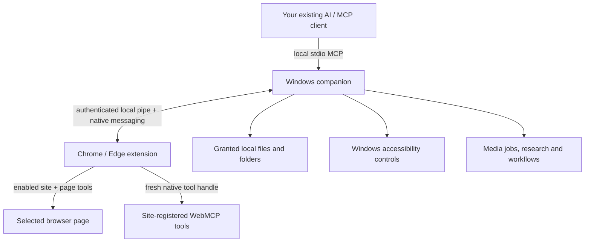

# Architecture

[Overview](../README.md) · [Capabilities](capabilities.md) · [Install](../INSTALL.md) · [Compatibility](compatibility.md)

ToolBraid connects an AI client to browser and local tools. The **extension** provides page interaction and native WebMCP access; the **Windows companion** provides the local MCP bridge, desktop/file tools and job state.



## Connection lifecycle

1. The user installs the public companion and loads the matching extension. The native messaging host is registered for the selected browser under the current Windows user.
2. The installer generates the local MCP configuration. An external client starts the companion over stdio; this is not a public internet endpoint.
3. The extension connects through authenticated native messaging/local pipe transport. The user explicitly enables control and site access.
4. The client discovers available tools. Page/frame/session-bound handles identify current targets; changing context can invalidate them.
5. Results return to the client. Its selected model may process them locally or through its provider.

The refreshed connector reloads validated configuration on reconnect. Concurrent requests share the reconnect; an interrupted mutation is not automatically retried. Updating files requires restarting an already-running MCP connection once.

## Optional integrated chat

The side panel can use a **local Codex App Server session** authenticated with the user's ChatGPT account. This is a separate conversation surface, not a requirement for using ToolBraid from an existing Codex session or other MCP client.

Selected-page sharing starts off. When enabled, the chat can use that connected page's tools and requests approval before browser mutations. Recent history is stored locally. The user's Codex limits apply; this chat route does not use a model API key.

## Resource boundaries

- **Browser:** site permission, direct-control opt-in and current page/frame context determine access. Some advanced operations attach the debugger on demand.
- **Files:** explicit file grants or scoped folder roots, bounded reads/writes and no overwrite for new writes/moves.
- **Desktop:** visible, enabled UI Automation controls and freshly revalidated targets—not unrestricted access to every application surface.
- **Jobs:** separate companion state for media, research, missions and schedules. Browser pause is not a universal job cancellation switch.
- **AI providers:** page, file or desktop results can leave the machine through the selected client or separately configured analysis provider.

Pages, tool output and imported content are untrusted input. They do not replace the user's instructions or authorize additional access. Approval behavior differs between panel chat and external clients; see [permissions](compatibility.md#permissions-and-data).

## Distribution layout

| Artifact | Purpose |
| --- | --- |
| Windows ZIP | Companion, bundled Node.js, installer and matching manual-install extension. |
| Extension ZIP | Chrome or unpacked Edge extension for an existing matching companion. |
| Edge submission ZIP | Keyless publisher artifact; not the manual-install extension. |
| Store MSIX | Separate Store companion distribution, subject to Microsoft certification. Not included in these release downloads. |

The public ZIP edition uses `%LOCALAPPDATA%\ToolBraid\public`; the separate Store edition uses `%LOCALAPPDATA%\ToolBraid\store`. Use the installed edition's generated configuration, and do not overwrite a Store registration with the ZIP installer accidentally.

## This repository

This repository holds public documentation, presentation assets, release checksums and support forms. Application source and its development test suite are not hosted here. Release ZIPs contain the runtime files required to use the product.

Documentation contributions can be checked with **Node.js 22 or later**, without installing dependencies:

```sh
node scripts/check-docs.mjs
```

The workflow checks repository-local document links and anchors, image references, canonical repository URLs and checksum-list structure. It does **not** build the companion, exercise live accounts or certify the downloaded binaries. Recorded runtime validation is documented [separately](compatibility.md#recorded-validation).
